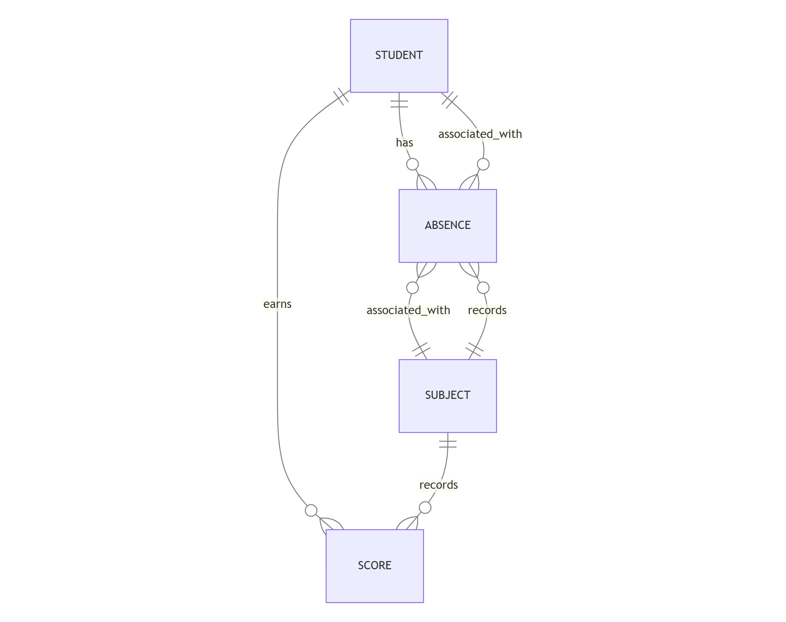

# Design Document

By Ilias Maatallaoui

Video overview: [(Demonstration Video)](https://youtu.be/FtdcyIcO_LE)

## Scope

MASSAR's database integrates all of the elements required to track students' academic performance. As such, included in the database's scope is:

* Students, including basic identifying information
* Subjects
* Scores
* Absences

Out of scope are elements like teacher information, classroom management, and administrative tasks.

## Functional Requirements

This database will support:

* CRUD operations for students and subjects
* Recording and tracking student scores across different subjects
* Managing student attendance records
* Generating academic performance reports

## Representation

Entities are captured in SQLite tables with the following schema.

### Entities

The database includes the following entities:

#### Students

The `students` table includes:

* `id`, which specifies the unique ID for the student as an `INTEGER`. This column thus has the `PRIMARY KEY` constraint applied.
* `first_name`, which specifies the student's first name as `TEXT`.
* `last_name`, which specifies the student's last name as `TEXT`.
* `massar_id`, which specifies the student's unique MASSAR identifier as `TEXT`. A `UNIQUE` constraint ensures no two students have the same MASSAR ID.
* `enrollment_date`, which specifies when the student was enrolled. Stored as `NUMERIC` with `DEFAULT CURRENT_TIMESTAMP`.

#### Subjects

The `subjects` table includes:

* `id`, which specifies the unique ID for the subject as an `INTEGER`. This column thus has the `PRIMARY KEY` constraint applied.
* `name`, which specifies the subject name (e.g., Mathematics, Physics) as `TEXT`, with a `UNIQUE` constraint.
* `code`, which specifies the subject code as `TEXT`, with a `UNIQUE` constraint.
* `coefficient`, which specifies the subject's weight as `NUMERIC`, representing the importance of the subject in final calculations.

All columns in the `subjects` table are required and hence should have the `NOT NULL` constraint applied.

#### Scores

The `scores` table includes:

* `id`, which specifies the unique ID for the score as an `INTEGER`. This column thus has the `PRIMARY KEY` constraint applied.
* `student_id`, which is the ID of the student as an `INTEGER`. This column has the `FOREIGN KEY` constraint applied, referencing the `id` column in the `students` table.
* `subject_id`, which is the ID of the subject as an `INTEGER`. This column has the `FOREIGN KEY` constraint applied, referencing the `id` column in the `subjects` table.
* `score_value`, which is the numerical score as `NUMERIC`, with a `CHECK` constraint ensuring the value is between 0 and 20.
* `semester`, which specifies the semester number as `INTEGER` with values 1 or 2.
* `assessment_type`, which specifies the type of assessment (e.g., 'Exam', 'Quiz', 'Continuous Assessment') as `TEXT`.
* `date_recorded`, which specifies when the score was recorded, stored as `NUMERIC` with `DEFAULT CURRENT_TIMESTAMP`.

#### Absences

The `absences` table includes:

* `id`, which specifies the unique ID for the absence record as an `INTEGER`. This column thus has the `PRIMARY KEY` constraint applied.
* `student_id`, which is the ID of the student as an `INTEGER`. This column has the `FOREIGN KEY` constraint applied, referencing the `id` column in the `students` table.
* `subject_id`, which is the ID of the subject as an `INTEGER`. This column has the `FOREIGN KEY` constraint applied, referencing the `id` column in the `subjects` table.
* `date`, which specifies the date of absence as `NUMERIC`, stored in SQLite's datetime format.
* `type`, which specifies the type of absence ('Justified' or 'Unjustified') as `TEXT`.
* `reason`, which stores the reason for absence as `TEXT`, can be NULL for unjustified absences.
* `timestamp`, which records when the absence was logged, stored as `NUMERIC` with `DEFAULT CURRENT_TIMESTAMP`.

All columns except `reason` are required and hence have the `NOT NULL` constraint applied where a `PRIMARY KEY` or `FOREIGN KEY` constraint is not. The `type` column has an additional `CHECK` constraint ensuring the value is either 'Justified' or 'Unjustified'.

This entity connects to the relationships as follows:

* One student can have 0 to many absences
* Each subject can have 0 to many absences recorded
* Each absence record belongs to exactly one student and one subject

### Relationships

The below entity relationship diagram describes the relationships among the entities in the database.

As detailed by the diagram:

* One student can have 0 to many scores. 0 if they have no recorded scores yet, and many if they have scores in multiple subjects or multiple scores in the same subject.
* A subject can have 0 to many scores associated with it: 0 if no scores have been recorded for that subject, and many if multiple students have scores recorded.
* Each score is associated with one and only one student and one and only one subject.
* One student can have 0 to many absences recorded across different subjects.
* Each subject can have 0 to many absences associated with it across different students.
* Each absence record must be associated with exactly one student and one subject, representing a specific absence instance.

The relationships are implemented through foreign keys in the database:

* In the `scores` table:
  * `student_id` references `students(id)`
  * `subject_id` references `subjects(id)`
* In the `absences` table:
  * `student_id` references `students(id)`
  * `subject_id` references `subjects(id)`

These relationships enable:
* Complete tracking of student performance across subjects
* Accurate recording of attendance patterns
* Data integrity through referential constraints
* Efficient querying of student records

## Optimizations

Per the typical usage patterns, the following indexes are created:

* On the `students` table: indexes on `massar_id` and `last_name` to speed up student lookups
* On the `scores` table: composite index on `student_id` and `subject_id` to optimize grade report generation
* On the `subjects` table: index on `code` to facilitate quick subject lookups

## Limitations

The current schema has the following limitations:

* Cannot track score modifications history
* Does not support weighted assessments within the same subject
* No support for custom grading scales (fixed to 0-20 range)